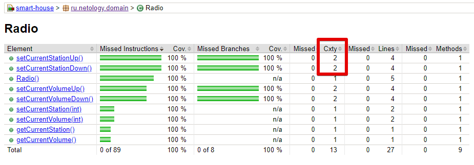

# JaCoCo Complexity

При выполнении данной задачи была взята работа из первого задания.
В настройках POM.xml в целях исследования счётчиком JaCoCo был выбран Complexity.

Согласно документации для вычисления количества необходимых тестов счетчик использует формулу:

**v(G) = B - D + 1**

где B - количество ветвей(Branch) в коде,

а D - количество точек принятия решений(Decision Points).

В используемом коде методов setCurrentStationUp()(обработка next) и setCurrentStationDown()(обработка prev) счетчик указывает количество необходимых тестов равное 4.

Созданный юнит-тест с 4 наборами тестовых данных обеспечивает 100% покрытие кода приложения.

Рекомендуемый порог сложности оценивается в 10, но может изменяться в зависимости от целей
и сложности проекта.

